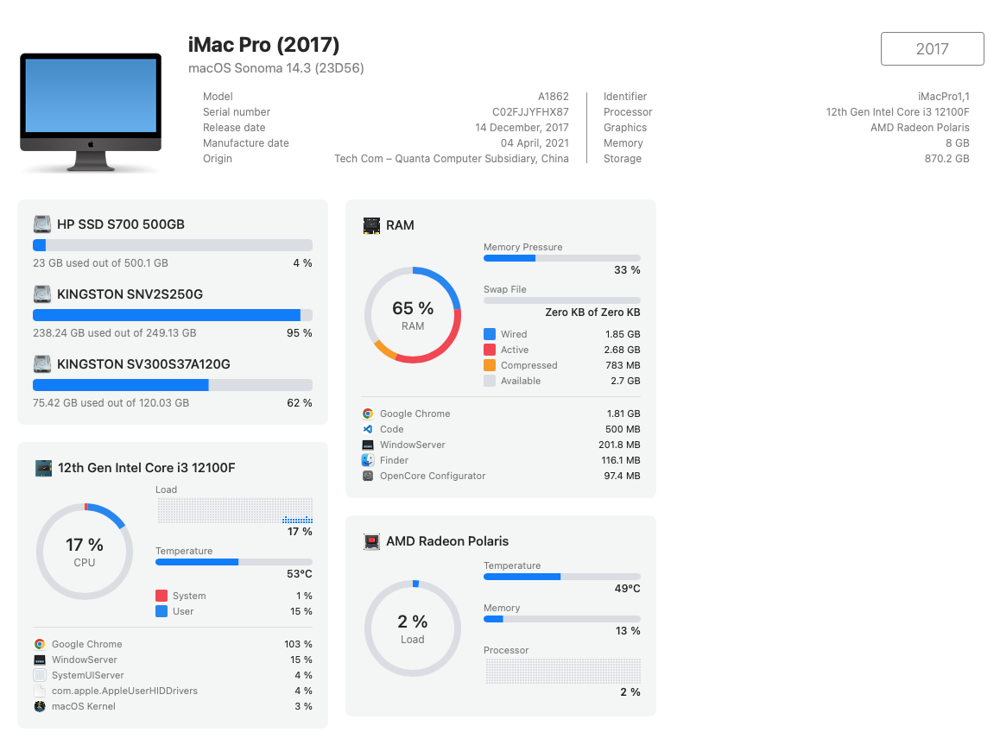
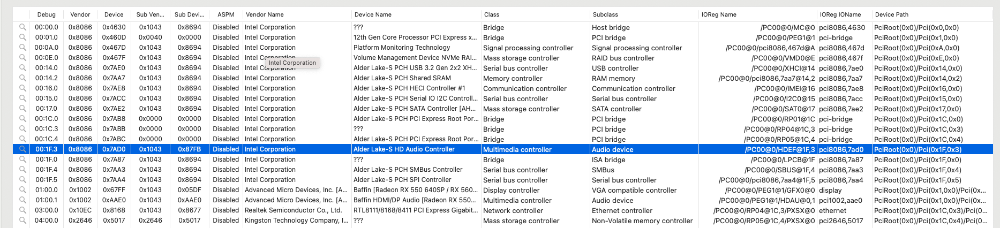

# Hackintosh-I3-12100f-PRIME-H610M-CS-D4-AMD-Radeon-Rx560

## Information
    - Mac OS : Sonoma
    - Bootloader: OpenCore 0.9.7

### Hardware

| Component |        Variant        |
| :-------: | :-------------------: |
| Mainboard |   PRIME H610M-CS D4   |
| Processor | Intel Core i3 12100f  |
|   Audio   |        ALC=11         |
| DDR4 RAM  |        3200Ghz        |
| NVMe SSD  |   SSD HP S700 500GB   |
| Graphics  |    Radeon™ RX 560     |
| WiFi / BT | Intel® Wi-Fi 6E AX201 |
|    Lan    |        RTL8111        |

---

#### Kexts

|            Kext             | Version |
| :-------------------------: | :-----: |
|      AirportItlwm.kext      | v0.9.2  |
|        AppleALC.kext        | v1.6.7  |
|     BlueToolFixup.kext      | v1.3.2  |
|       CPUFriend.kext        | v1.3.2  |
| IntelBluetoothFirmware.kext | v1.3.2  |
|     IntelBTPatcher.kext     | v0.3.3  |
|          Lilu.kext          | v0.3.3  |
|     RestrictEvents.kext     | v1.1.2  |
|        NVMeFix.kext         | v1.1.1  |
|      SMCProcessor.kext      | v2.3.0  |
|       SMCSuperIO.kext       | v2.6.8  |
|       VirtualSMC.kext       | v2.6.8  |
|     WhateverGreen.kext      | v1.1.5  |
|     RealtekRTL8111.kext     | v1.1.1  |

#### Update and test

|                           Update                            | Link or Note                                                   | Result |
| :---------------------------------------------------------: | -------------------------------------------------------------- | ------ |
| 1.add RadeonSensor.kext  +  SMCRadeonGPU.kext + Application | [PRIME H610M-CS D4](https://github.com/aluveitie/RadeonSensor) | OK     |
|            1.change IntelBluetootchFirmware.kext            | v2.3.0                                                         | NG     |
|                  1.change AirpotItlwm.kext                  | v2.3.0-alpha                                                   | NG     |
|                1.change IntelBTPatcher.kext                 | v2.6.8                                                         | NG     |
|                 1.change BlueToolFixup.kext                 | v2.6.8                                                         | NG     |
|                      1.add itlwm.kext                       |                                                                | NG     |
|                  2. add FeatureUnlock.kext                  | v1.1.5 https://github.com/acidanthera/FeatureUnlock/releases   | Keep   |
|                     2.add AppleIGC.kext                     | https://github.com/SongXiaoXi/AppleIGC/releases/tag/v1.4       | Keep   |
|                2. change   AirpotItlwm.kext                 |                                                                | NG     |
|           2. change IntelBluetootchFirmware.kext            |                                                                | NG     |
|                2. change IntelBTPatcher.kext                |                                                                | NG     |
|                2. change BlueToolFixup.kext                 |                                                                | NG     |
|                    2. change itlwm.kext                     |                                                                | NG     |
|                3.set: ResizeAppleGpuBars->0                 |                                                                | Keep   |
|     3.add PciRoot(0x0)/Pci(0x1F,0x3) audio, layout =11      |                                                                | Keep   |
|         3.boot arg add :  agdpmod=pikera -wegnoigpu         | to disable igpu                                                | Keep   |
|           3. change to Mac Pro 2019  (MacPro7,1)            | geekbench gpu tăng, cpu thì giảm, hêt hiên tuợng giật màn hình | Keep   |
|                                                             |                                                                |        |
|                                                             |                                                                |        |
|                                                             |                                                                |        |
|                                                             |                                                                |        |
|                                                             |                                                                |        |
|                                                             |                                                                |        |
|                                                             |                                                                |        |
|                                                             |                                                                |        |
|                                                             |                                                                |        |
|                                                             |                                                                |        |
|                                                             |                                                                |        |
|                                                             |                                                                |        |
|                                                             |                                                                |        |
|                                                             |                                                                |        |
|                                                             |                                                                |        |
|                                                             |                                                                |        |
|                                                             |                                                                |        |
|                                                             |                                                                |        |
|                                                             |                                                                |        |
|                                                             |                                                                |        |
|                                                             |                                                                |        |
|                                                             |                                                                |        |
|                                                             |                                                                |        |
|                                                             |                                                                |        |
|                                                             |                                                                |        |
|                                                             |                                                                |        |
|                                                             |                                                                |        |
|                                                             |                                                                |        |
|                                                             |                                                                |        |
|                                                             |                                                                |        |
|                                                             |                                                                |        |
|                                                             |                                                                |        |
|                                                             |                                                                |        |
|                                                             |                                                                |        |
|                                                             |                                                                |        |
|                                                             |                                                                |        |
|                                                             |                                                                |        |
|                                                             |                                                                |        |
|                                                             |                                                                |        |

3. truớc 

---

Tham khảo :  XHCI-unsupported.kext	v0.9.2	https://github.com/RehabMan/OS-X-USB-Inject-All/tree/master/XHCI-unsupported.kext : kext hoat động với usb 
USBToolBox.kext	v1.1.1	USBToolBox/kext
UTBMap.kext	v1.1.1	USBToolBox/tool
CPUFriend.kext
CPUFrinedDAtaProvider.kext
HibernationFixup.kext